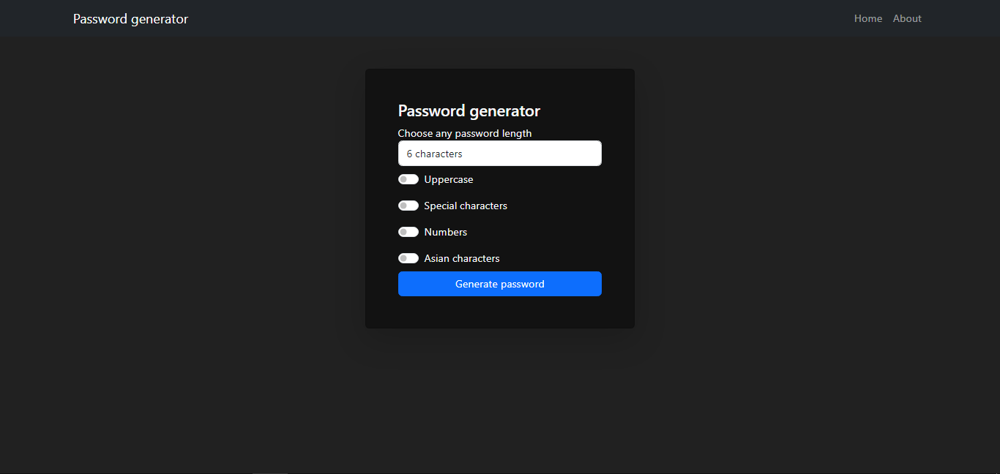

# Django Password Generator

This is a simple example of a small Web Application that is capable of generating random passwords with custom parameters. This was built with Python and Django.
This project is based on [Fazt](https://youtu.be/I0m92SBfDI8), a great YouTube Channel related to programming.

*Note: Pipenv was used as virtual enviroment*

### Preview

